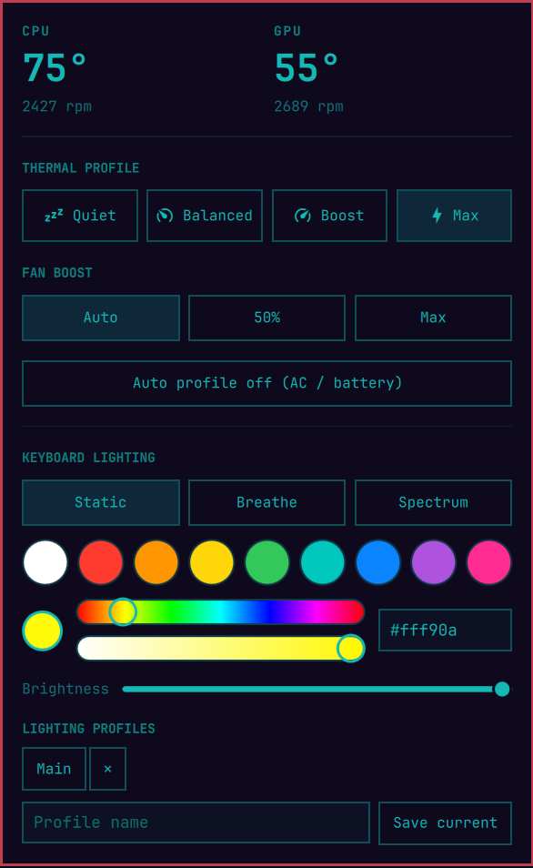

# Dell G16 AWCC-Oma

An **Alienware Command Center alternative for the Dell G16, made for Omarchy.** A bar widget and panel for thermal profile, fan boost, keyboard lighting (colour, static / breathe / spectrum, brightness, saved profiles), CPU/GPU temperatures with fan speeds — plus the two hardware keys: the **F7 light key** and the **G key**.



## Why it is G16-only
The kernel interfaces are shared with other G-series and Alienware laptops, but the **keyboard-light controller, the fan layout and the hardware keys are not**, and a wrong write can leave the lighting or the fans in a state that is hard to undo. So this package checks the machine before it writes anything:

| Laptop | What happens |
|---|---|
| **Dell G16 7630** | verified — everything works (lighting, thermal profile, fan boost, F7 and G keys) |
| other **Dell G16** (7620, 7625, 7635, …) | *unverified* — sensors work; writes stay **off** until you run `awcc doctor` and, if the report looks right, `awcc allow-unverified on` |
| anything else (other Dell/Alienware models, other brands) | sensors only; the installer refuses unless you pass `--force`; the widget shows a notice |

Every write path is guarded — thermal profile, fan boost, the USB lighting controller and the background service — and fan boost additionally requires the exact G16 fan layout (CPU Fan + GPU Fan on `alienware_wmi`). The lighting code only ever opens the USB device `187c:0551`.

If you own another G16 revision and it works, please open an issue with the output of `awcc doctor` so it can be added to the verified list.

## What is in the repository
| Path | What it is |
|---|---|
| `manifest.json`, `BarWidget.qml` | the Omarchy bar widget + panel (plugin root) |
| `bin/awcc` | the CLI backend (Python 3, standard library only) |
| `udev/70-awcc.rules` | lets your user (not only root) use the three interfaces above |
| `systemd/awcc.service` | optional user service: restores lighting at login, switches profile on AC/battery |
| `install.sh`, `uninstall.sh` | consent-based installer and remover |

## Requirements
- Omarchy with the Quickshell shell (plugins in `~/.config/omarchy/plugins/`)
- Kernel drivers `alienware-wmi` and `dell-pc` (in current kernels)
- `python3`, `systemd` user services, `polkit` (`pkexec`, only for the udev rules), `notify-send` (optional)
- membership of the `wheel` group (the Omarchy default)

## Install
```bash
git clone https://github.com/rikalonikola/omarchy-plugin-dell-g16-awcc-oma.git && cd omarchy-plugin-dell-g16-awcc-oma
./install.sh --dry-run     # prints every step, changes nothing
./install.sh               # asks before each step
awcc doctor                # read-only health check
omarchy bar put io.github.rikalonikola.dell-g16-awcc-oma --section right    # show the widget in the bar
```
`install.sh` does exactly this, and nothing else:
1. checks the model (see above),
2. copies `bin/awcc` to `~/.local/bin/awcc` (asks first if a different file is already there),
3. copies `manifest.json` + `BarWidget.qml` to `~/.config/omarchy/plugins/io.github.rikalonikola.dell-g16-awcc-oma/`,
4. asks, then installs and starts `~/.config/systemd/user/awcc.service`,
5. asks, then installs `/etc/udev/rules.d/70-awcc.rules` with `pkexec` and reloads udev.

It never edits `~/.config/omarchy/shell.json`, your Hyprland bindings or `~/.config/awcc/config.json`. Options: `--yes`, `--no-udev`, `--no-service`, `--force`.

## The F7 light key and the G key
On the G16 the F7 "light" key arrives as evdev `KEY_F18` (188) and the **G key** as evdev 701 — Hyprland keycodes **196** and **709**. They only produce key events; nothing happens until you bind them. `awcc doctor` tells you whether the keyboard reports them and whether you have bindings.

Omarchy Lua bindings (`~/.config/hypr/bindings.lua`):
```lua
o.bind("code:196", "Keyboard light: off / 50% / 100%", "awcc rgb cycle")
o.bind("code:709", "G key: fans auto / max", "awcc fan toggle")
```
Classic Hyprland (`bindings.conf`):
```
bind = , code:196, exec, awcc rgb cycle
bind = , code:709, exec, awcc fan toggle
```
(Use the full path, e.g. `/home/you/.local/bin/awcc`, if your bindings do not see `~/.local/bin`.) The G key is a "G-mode" toggle: fans to max plus the performance profile, and back.

## Privileges (what the udev rules allow)
The rules give your logged-in user, without sudo:
- access to the keyboard-lighting USB controller `187c:0551` (`TAG+="uaccess"`),
- write access for group `wheel` to `/sys/class/platform-profile/*/profile` (thermal profile),
- write access for group `wheel` to the `fan*_boost` files of the `alienware_wmi` hwmon (fan boost).

Without them `awcc` needs root. There is no sudoers entry, no network access and no downloaded code.

## Removal
```bash
./uninstall.sh --dry-run
./uninstall.sh            # widget, CLI, service and (asks first) the udev rule
```
Delete the widget's entry (`"id": "io.github.rikalonikola.dell-g16-awcc-oma"`) from `bar.layout` in `~/.config/omarchy/shell.json`; the script only tells you, it never edits your bar. Your lighting profiles in `~/.config/awcc/config.json` are kept unless you pass `--purge`. Remove any key bindings you added yourself.

## Reporting a problem
Run `awcc doctor` (add `--json` for a machine-readable version) and paste the output. It is read-only and prints the model, kernel interfaces, permissions, service state and key support — no serial numbers or personal data.

## CLI
```
awcc doctor [--json]                          read-only health check
awcc status [--json]                          profile, temperatures, fans, power, model
awcc profile [quiet|balanced|performance|…]   get or set the thermal profile
awcc fan [cpu|gpu|all] [0-100] | toggle       fan boost
awcc rgb color RRGGBB | mode static|breathe|spectrum | brightness N | on | off | cycle | restore | save
awcc rgb profile save|apply|delete|list NAME  saved lighting profiles
awcc auto on|off [--ac PROFILE] [--battery PROFILE]
awcc allow-unverified [on|off]                writes on a G16 revision that is not the verified one
awcc daemon                                   what the user service runs
```

## Hardware notes
- Fan boost is `fanN_boost` in the `alienware_wmi` hwmon, raw 0–255 (exposed as 0–100). Changing the thermal profile makes the firmware reset fan boost, so set the profile first, then the boost.
- Keyboard lighting is the AW-ELC USB controller, AlienFX API v4: 33-byte packets as HID `SET_REPORT` control transfers (`0x21, 9, wValue 0x0202`), not through hidraw. The G16 keyboard is a single zone (id 0).
- A saved animation only shows at the next power-up; the temporary animation with "config play" changes the lights immediately.

## Credits and license
Not affiliated with Dell or Alienware; use at your own risk — fan and thermal control act on real hardware. The lighting protocol was worked out with [tr1xem/AWCC](https://github.com/tr1xem/AWCC) (`src/LightFX.cpp`, `src/EffectController.cpp`) as the protocol reference; the tool itself is a separate Python implementation. Released under the MIT License — see `LICENSE`.
